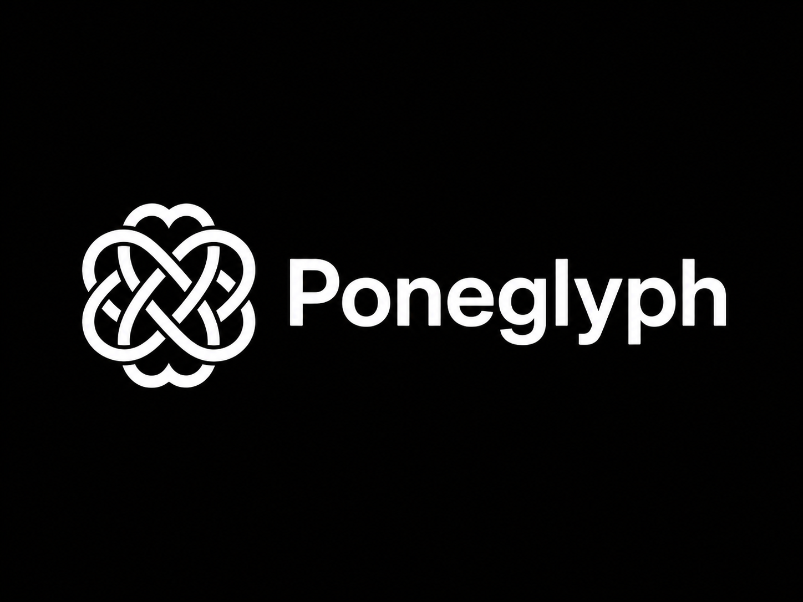
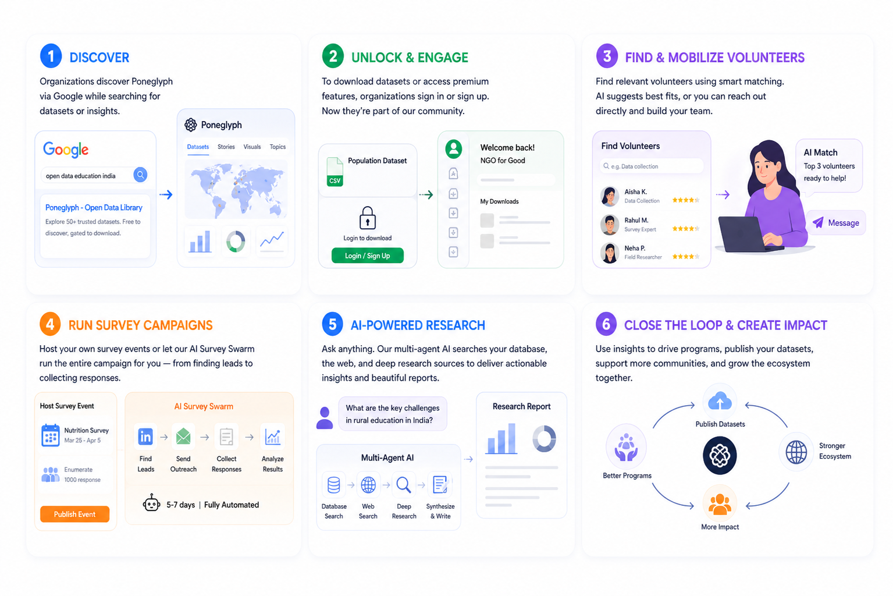
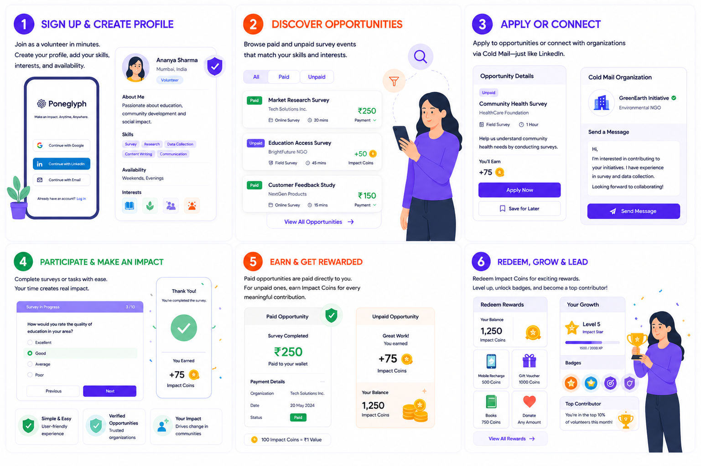
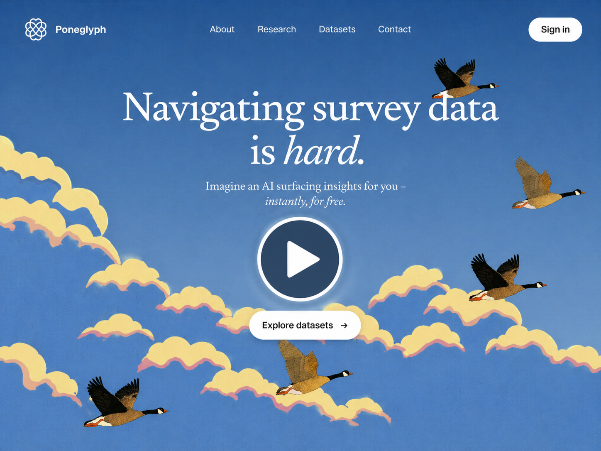
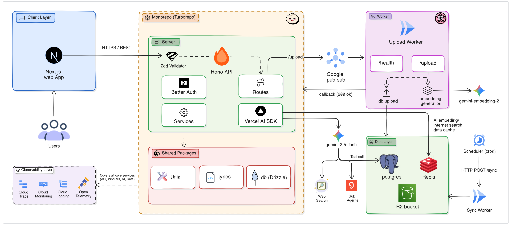

  
  
  
  
  
  
  
  
  
  
  
  
  
  
  

<h1 align="center">Poneglyph</h1>

  <strong>A unified platform for open data discovery, AI-powered research, and volunteer-driven data collection.</strong>
   
  <em>Think of it as GitHub for survey data  where organizations publish, volunteers contribute, and AI agents analyze.</em>

  <a href="https://youtu.be/9IbQkpQFVAs">View Demo</a>
  ·
  <a href="https://github.com/Itz-Agasta/poneglyph/issues">Report Bug</a>
  ·
  <a href="https://github.com/Itz-Agasta/poneglyph/issues">Request Feature</a>
  ·
  <a href="https://github.com/Itz-Agasta/poneglyph/pulls">Send a Pull Request</a>

---

## Overview

Today, survey and research data is scattered across dozens of platforms, difficult to navigate, and nearly impossible to turn into actionable insight. Poneglyph solves this by bringing **50+ open data sources** into a single, searchable platform and layering AI research agents on top so users can ask questions, analyze datasets, and extract meaningful insights without manual effort.

### Key Capabilities

- **Unified Data Library** — Search, explore, and understand datasets from 50+ external sources in one place, with semantic vector search powered by pgvector HNSW indexes.
- **AI Research Agents** — Chat with your data. Ask natural-language questions and get synthesized answers backed by multi-source analysis using Google Gemini, Groq, and Tavily.
- **Volunteer Collaboration** — Organizations can post fieldwork opportunities, accept volunteer applications, and manage data collection campaigns, all on-platform.
- **Dual Collection Modes** — Hire real volunteers for on-the-ground work, or run fully automated survey campaigns using AI agent swarms.
- **Incentive System** — A digital currency framework rewards contributors for their work, redeemable for platform benefits.
- **SEO-Optimized Discoverability** — Datasets are structured for organic search, driving a freemium + lead generation model (free exploration, login-gated downloads).

---

## How Organizations use Poneglyph

## How Volunteers use Poneglyph

---

## Watch our Demo

## Architecture

Poneglyph is a **Turborepo monorepo** with a polyglot architecture. TypeScript for the web and API layer, Rust for high-performance data workers.

### Tech Stack

| Layer             | Technology                                                             |
| ----------------- | ---------------------------------------------------------------------- |
| **Frontend**      | Next.js 16, React 19, TailwindCSS v4, shadcn/ui, D3.js, Recharts, GSAP |
| **API**           | Hono, Bun runtime, Vercel AI SDK (v6)                                  |
| **AI/ML**         | Google Gemini, Groq, Tavily, pgvector (768-dim HNSW)                   |
| **Auth**          | Better Auth, Resend (email)                                            |
| **Database**      | PostgreSQL, Drizzle ORM                                                |
| **Workers**       | Rust (Tokio, SQLx, Lapin)                                              |
| **Message Queue** | Google Pub/Sub                                                         |
| **Storage**       | Cloudflare R2                                                          |
| **Infra**         | Terraform, Google Cloud Run                                            |
| **Tooling**       | Turborepo, TypeScript, Zod, oxfmt, oxlint                              |

---

## Contact

This project is licensed under the [MIT License](LICENSE). For questions or feedback, reach out at [rupam.golui@proton.me](mailto:rupam.golui@proton.me).
